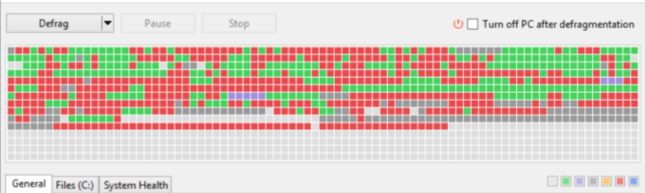

# Game Idea

A web/mobile app, that’s playable.

Game uses only standard/native UI controls for input

Perform simple micro-game style tasks, similar to tasks in among us (connect wires, upload data, clean vent, etc)

Tasks could include: sort items into like groups, basic “cleanup” or maintenance tasks, general feeling should be things that give a small feeling of satisfaction by decreasing entropy, similar sense of satisfaction to something like powerwash simulator

This game does not have “characters” or backstory or lore, it is largely just a player interacting with a system. The system does have a theme that informs how it is structured, but is not overtly presented to the player. The theme is that the player is in a sense a simplified cog or sub-agent in a large agentic AI. The large AI is given a high level task, which is broken down by players into sub-tasks, then assigned out to other players to be completed. There are multiple levels of task breakdown, with the simple “cleanup” style tasks being at the bottom, but being composable into larger tasks.

This should not attempt to be an accurate 1:1 simulation of how agentic AI operates, it should just be using that as a thematic framing device (although, again, not overtly presented to the player). 

Completing tasks earns you tokens.  Tasks can be offered for other users to complete in exchange for tokens

Task types:

- Atomic tasks - A task that can be completed by a single player
- Simple tasks - An atomic task that involves a simple entropy reducing operation, awards a small number of tokens
    - Examples:
        - Sort an unsorted list by some criteria (alphabetical, etc)
        - Separate objects into groups (eg by color, shape, etc)
        - Match a target color using RGB sliders
        - Perform an arithmetic calculation
        - Defragment (think something like the old Windows defrag tool)
            - 
            
            
            
- Hard tasks - An atomic tasks that involves more complex reasoning or puzzles, awards a larger number of tokens
- Compositie tasks - A task that is made up of atomic tasks or other composite tasks, task is completed when all sub-tasks are completed. Awards a number of tokens greater  than the sum of the component tasks

After completing a few simple training tasks presented by the game, you unlock the ability to take on tasks from the task board, which is tasks being offered by other players in exchange for tokens.

At a certain point layer you unlock the ability to take on composite tasks and assign out the sub tasks to other players.

I would like for players to have some agency in determining the sub-task composition of a composite task, which some level of correctness (ie if you pick the wrong sub-tasks then the composite task will fail and you will not be awarded the tokens), although I’m still considering how best to achieve this.